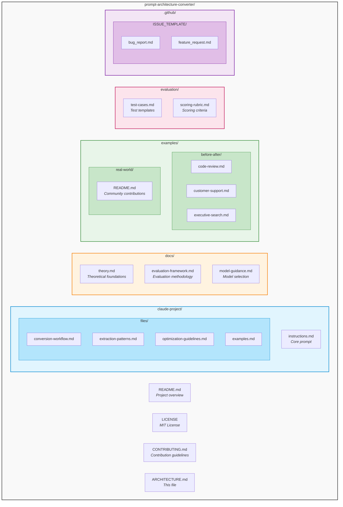
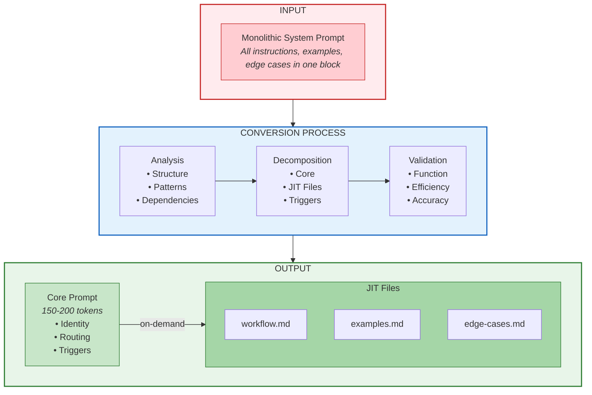
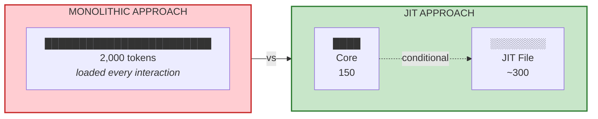
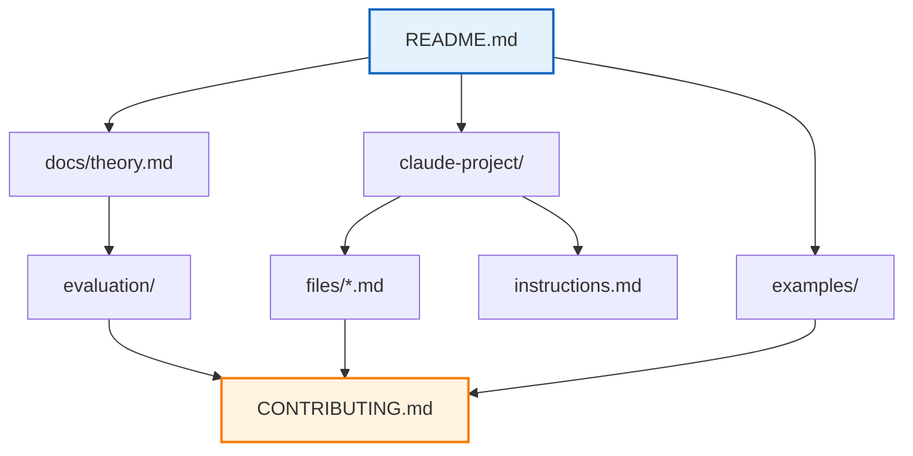

# Repository Architecture

## Overview

This repository implements a framework for converting monolithic system prompts into modular Just-in-Time (JIT) architectures, based on Anthropic's context engineering research.



<details>
<summary>Text version (click to expand)</summary>

```
prompt-architecture-converter/
│
├── README.md                    # Project overview and quick start
├── LICENSE                      # MIT License
├── CONTRIBUTING.md              # Contribution guidelines
├── ARCHITECTURE.md              # This file
│
├── claude-project/              # Claude Projects implementation
│   ├── instructions.md          # Core prompt (Project Instructions)
│   └── files/                   # JIT files (Project Files)
│       ├── conversion-workflow.md
│       ├── extraction-patterns.md
│       ├── optimization-guidelines.md
│       └── examples.md
│
├── docs/                        # Documentation
│   ├── theory.md                # Theoretical foundations
│   ├── evaluation-framework.md  # Evaluation methodology
│   └── model-guidance.md        # Model selection guidance
│
├── examples/                    # Conversion examples
│   ├── before-after/            # Documented conversions
│   │   ├── code-review.md
│   │   ├── customer-support.md
│   │   └── executive-search.md
│   └── real-world/              # Community contributions
│       └── README.md
│
├── evaluation/                  # Evaluation tools
│   ├── test-cases.md            # Test case templates
│   └── scoring-rubric.md        # Scoring criteria
│
└── .github/
    └── ISSUE_TEMPLATE/
        ├── bug_report.md
        └── feature_request.md
```

</details>

## Component Details

### 1. Claude Projects Implementation (`claude-project/`)

The core implementation designed for use with Claude Projects.

```
claude-project/
├── instructions.md          # → Copy to Project Instructions
└── files/                   # → Upload to Project Files
    ├── conversion-workflow.md
    ├── extraction-patterns.md
    ├── optimization-guidelines.md
    └── examples.md
```

**Usage Flow:**
```
┌─────────────────────────────────────────────────────────────┐
│                    Claude Project Setup                      │
├─────────────────────────────────────────────────────────────┤
│  1. Create new Claude Project                                │
│  2. Paste instructions.md → Project Instructions             │
│  3. Upload files/*.md → Project Files                        │
│  4. Start conversation with prompt to convert                │
└─────────────────────────────────────────────────────────────┘
```

**JIT Trigger Logic:**

| User Intent | Loaded File | Token Impact |
|-------------|-------------|--------------|
| Understand methodology | conversion-workflow.md | ~800 tokens |
| Identify extraction patterns | extraction-patterns.md | ~700 tokens |
| Optimize token usage | optimization-guidelines.md | ~600 tokens |
| See practical examples | examples.md | ~900 tokens |

### 2. Documentation (`docs/`)

Theoretical and practical guidance for understanding and using the framework.

```
docs/
├── theory.md                # Context engineering principles
│                            # - Context as finite resource
│                            # - JIT retrieval patterns
│                            # - Goldilocks zone concept
│
├── evaluation-framework.md  # Systematic evaluation approach
│                            # - 4 dimensions (100 points total)
│                            # - Scoring rubrics
│                            # - Test protocols
│
└── model-guidance.md        # Model selection considerations
                             # - Task complexity analysis
                             # - Capability matching
                             # - Platform-specific notes
```

### 3. Examples (`examples/`)

Concrete conversion demonstrations with before/after comparisons.

```
examples/
├── before-after/
│   ├── code-review.md       # ~2,200 → ~470 tokens (79% reduction)
│   ├── customer-support.md  # ~1,500 → ~350 tokens (77% reduction)
│   └── executive-search.md  # ~3,000 → ~680 tokens (77% reduction)
│
└── real-world/
    └── README.md            # Community contribution placeholder
```

**Example Structure:**
```markdown
# Before/After: [Domain]

## Overview
- Complexity: [Low/Moderate/High]
- Original Size: ~X tokens
- Target Reduction: Y-Z%

## Before: Monolithic Prompt
[Full original prompt]

## After: JIT Architecture
### Core Prompt (~N tokens)
[Minimal routing logic]

### JIT Files
[Modular components]

## Results Summary
[Token analysis table]
```

### 4. Evaluation (`evaluation/`)

Tools for measuring conversion effectiveness.

```
evaluation/
├── test-cases.md            # Test case template
│                            # - Metadata structure
│                            # - Scenario categories
│                            # - Metrics collection
│
└── scoring-rubric.md        # Evaluation criteria
                             # - Token Efficiency (20 pts)
                             # - Functionality (40 pts)
                             # - Retrieval Accuracy (25 pts)
                             # - Maintainability (15 pts)
```

**Scoring Model:**
```
Total Score = Token Efficiency (20) 
            + Functionality (40) 
            + Retrieval Accuracy (25) 
            + Maintainability (15)
            = 100 points max

Rating Scale:
90-100: Excellent (Production ready)
80-89:  Good (Minor refinements needed)
70-79:  Acceptable (Improvements recommended)
60-69:  Needs Work (Significant revision required)
<60:    Poor (Consider alternative approach)
```

## Data Flow Architecture



## Token Economics



| Approach | Tokens per Interaction | Reduction |
|----------|------------------------|-----------|
| Monolithic | 2,000 (constant) | - |
| JIT | 150 + ~300 = ~450 (variable) | ~77% |

## File Relationships



## Extension Points

### Adding New Examples
```
examples/
├── before-after/
│   ├── [existing].md
│   └── your-domain.md    # Add here
└── real-world/
    └── your-validated-example.md  # With metrics
```

### Adding New JIT Patterns
```
claude-project/files/
├── [existing].md
└── new-pattern.md        # Add here
                          # Update instructions.md triggers
```

### Platform Adaptations
```
[future]/
├── api-implementation/   # For API-based usage
├── langchain-adapter/    # For LangChain integration
└── llamaindex-adapter/   # For LlamaIndex integration
```

## Version History

| Version | Status | Description |
|---------|--------|-------------|
| v1.0 | Current | Experimental framework release |
| v1.1 | Planned | Community test cases |
| v1.2 | Planned | Empirical validation |
| v2.0 | Planned | Validated benchmarks |

---

*This architecture document reflects the current experimental state of the framework.*
